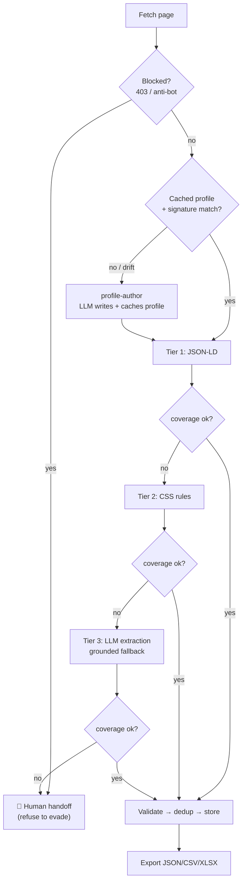
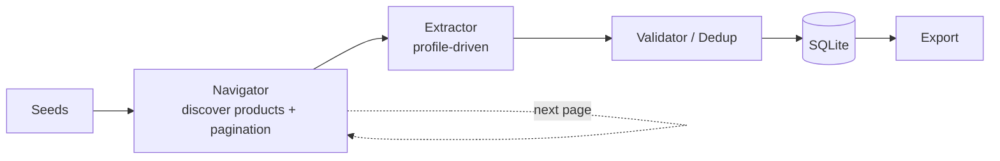
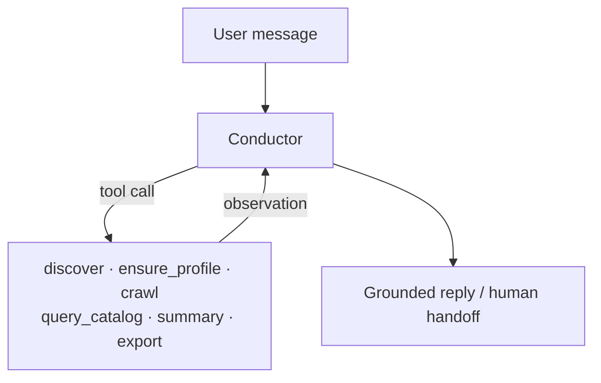

# Architecture

## Diagrams

**Extraction escalation ladder** — cheap & deterministic first, AI only where it pays,
and a human as the final layer (never evade a block):



**Crawl pipeline** (deterministic core) — discovery loops over pagination:



**Conversational layer** — the conductor turns NL into grounded tool calls:



## Guiding principle: deterministic where possible, AI where it pays

A live probe of Safco showed the catalog ships clean `schema.org` **JSON-LD in
static HTML** (name, SKU, brand, price, availability, image, description, detail
URL). So the fast path needs **no LLM at all**. AI is reserved for the three places
it earns its cost:

1. **Authoring/repairing extraction profiles** for unseen or changed templates.
2. **Classifying ambiguous pages** the rules can't resolve, and **extraction
   fallback** for irregular/sparse layouts.
3. **Answering natural-language questions** over the scraped catalog (reporter).

## Two runtimes over one toolset

| | Deterministic core | Agent layer |
|---|---|---|
| Entry | `safco crawl` | `safco author-profile`, `safco report`, in-crawl fallback |
| Needs a key? | **No** — uses cached profiles | Yes (`ANTHROPIC_API_KEY`) or Claude CLI (Max) |
| Role | Reliable, fast, repeatable bulk crawling | Profile authoring/repair, ambiguous classification, Q&A |
| Guarantee | Always runs on clone | Practical, grounded AI value |

The same Python tools (`fetch`, `extract_with_profile`, `validate`, `store`,
`query`) are driven both ways.

## The self-adapting extractor (the heart)

```
            unseen page
                │
      ┌─────────▼──────────┐     profile + signature match?
      │  profile cache      │────────── yes ──────────┐
      │ (domain+template)   │                          │
      └─────────┬──────────┘                          │
                │ no / drift / low coverage           │
      ┌─────────▼──────────┐                          │
      │ profile-author AGENT│  inspects DOM/JSON-LD,   │
      │ writes field→rule   │  validates, caches       │
      └─────────┬──────────┘                          │
                └───────────────┬──────────────────────┘
                                ▼
                 extract_with_profile(html, profile)   ← generic, site-agnostic
                                ▼
                     validate → coverage gate → store
```

## Agents and responsibilities

| Agent | Responsibility | Built |
|---|---|---|
| orchestrator | Sequence discover → extract → validate → store → export | `orchestrator.py` |
| navigator | Discover product URLs / subcategories / pagination | `tools/navigate.py` |
| page-classifier | Page type (rule-first, LLM if ambiguous) | profile `match` + LLM |
| profile-author | Write/repair + cache extraction profiles | `agents/profile_author.py` ⭐ |
| extractor | Apply profile; LLM fallback + grounding guard | `tools/extract.py` + `agents/extractor.py` |
| validator | Normalize, validate, dedup, coverage | `tools/validate.py` |
| reporter | Grounded Q&A over the catalog | `agents/reporter.py` ⭐ |

Each agent's role is also written as a `.claude/skills/<name>/SKILL.md` so the
workflow is runnable inside Claude Code, not just as Python.

## Grounding (anti-hallucination)

Agents that read data, produce output, or view pages obey **only** what they
actually see — script output, database rows, and the fetched page. This is enforced
both in the prompts and in code: the LLM extractor drops any value not literally
present in the page (`agents/extractor.py` grounding guard), the profile-author's
output is validated by re-running it on the page, and the reporter answers only from
DB rows.
