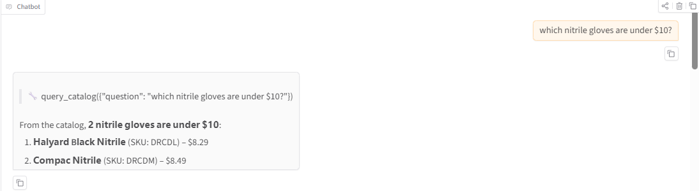
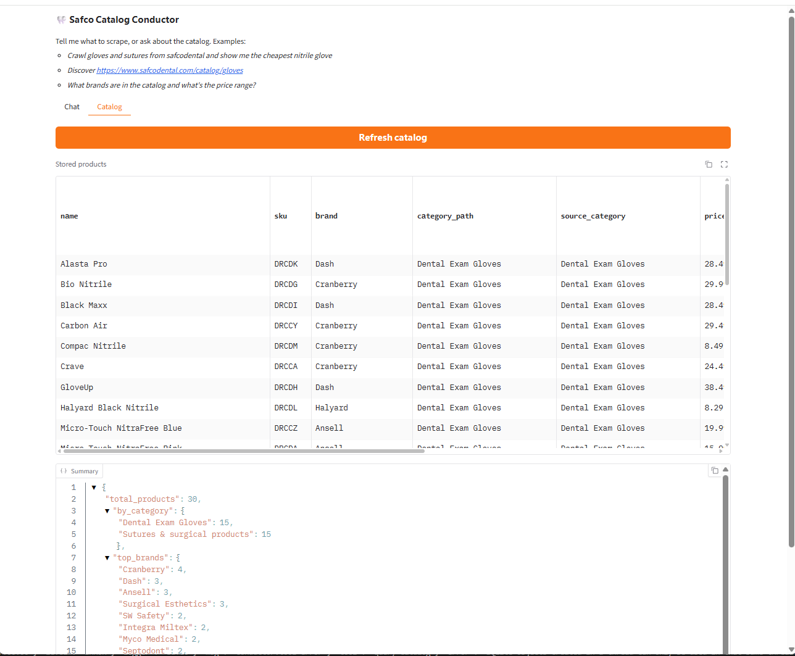

# Demo & Screenshots

Real, reproducible runs of the system. Transcripts below are actual output; the
screenshot slots are for you to fill once you run the UI locally (see the capture
guide at the bottom).

## 1. Deterministic crawl (no API key) — Safco, 2 categories

```text
$ safco crawl --fresh
... 32 pages fetched, 30 products, 0 dead-letters, avg field-coverage 0.89
Stored 30 products -> data/ (json/csv/xlsx) + data/runtime/safco.db
```

## 2. Any-site + pagination (live, ethical) — books.toscrape.com

A non-JSON-LD site, crawled with a CSS profile + pagination following. Proves the
generic extractor is genuinely site-agnostic. Sample output: [../data/books_demo/](../data/books_demo/).

```text
$ safco crawl   # seeds = books.toscrape catalogue, max_pages: 3
pages_fetched: 3 | products_stored: 60 | dead_letters: 0 | blocked: 0
field_coverage: name 100%, price 100%, availability 100%, image_urls 100%
  - A Light in the Attic              | £51.77 | in_stock
  - Aladdin and His Wonderful Lamp    | £53.13 | in_stock
  ... (60 books across pages 1→2→3)
```

## 3. Compliance — anti-bot site is detected, not evaded (frontierdental.com)

Pointed at a Cloudflare-protected, AI-restricted site. The tool detects the block and
**hands off to a human instead of evading** — the production-minded behaviour.

```text
$ safco chat "crawl https://www.frontierdental.com/ca/en/home"
  🔧 crawl({"seed_urls": ["https://www.frontierdental.com/ca/en/home"]})
The site is protected by anti-bot measures (HTTP 403) and its robots policy disallows
AI crawlers. I did not attempt to bypass it. To proceed, a human would need to confirm
scraping is permitted and supply the page via an authorized browser.

$ safco stats
🙋 Human-help requests (1):
  - https://www.frontierdental.com/ca/en/home
      blocked: HTTP 403 (anti-bot / access denied)
      → Site is bot-protected. A human should confirm scraping is permitted (robots/ToS),
        then supply the page HTML from an authorized browser. Do NOT bypass the protection.
```

## 4. Grounded Q&A — conductor / reporter

```text
$ safco chat "how many products and what's the price range? use the catalog summary"
  🔧 summary({})
30 products across 2 categories (Gloves 15, Sutures 15). Price $8.29–$1,118.99,
avg $93.20. All 30 in stock.

$ safco report "which nitrile gloves are under $10? name, sku, price"
1. Compac Nitrile — DRCDM — $8.49
2. Halyard Black Nitrile — DRCDL — $8.29
```

## 5. Web UI (Gradio)

`safco ui` → http://127.0.0.1:7860 — a Chat tab (the conductor) and a Catalog tab
(live product table + summary).

<!-- SCREENSHOT: chat tab -->
> __ ← replace with your screenshot

<!-- SCREENSHOT: catalog tab -->
> __ ← replace with your screenshot

---

## How to capture the UI screenshots / a GIF

1. Enable a backend in `config.yaml` (`llm.backend: claude_cli` or `anthropic`).
2. In a **normal terminal** (not inside Claude Code), run:
   ```bash
   pip install -e ".[ui]"
   safco ui
   ```
3. The browser opens at http://127.0.0.1:7860.
   - **Chat tab**: type *"crawl gloves from safco and show me the cheapest nitrile glove"*,
     wait for the answer, screenshot it.
   - **Catalog tab**: click **Refresh**, screenshot the product table + summary.
4. Save the images as `docs/images/ui-chat.png` and `docs/images/ui-catalog.png`
   (create the `docs/images/` folder). They'll replace the placeholders above.
5. For a short GIF, use [ScreenToGif](https://www.screentogif.com/) (Windows) or
   `Win+G` Game Bar to record a 10–15s clip of one chat → result, and save as
   `docs/images/demo.gif`.
