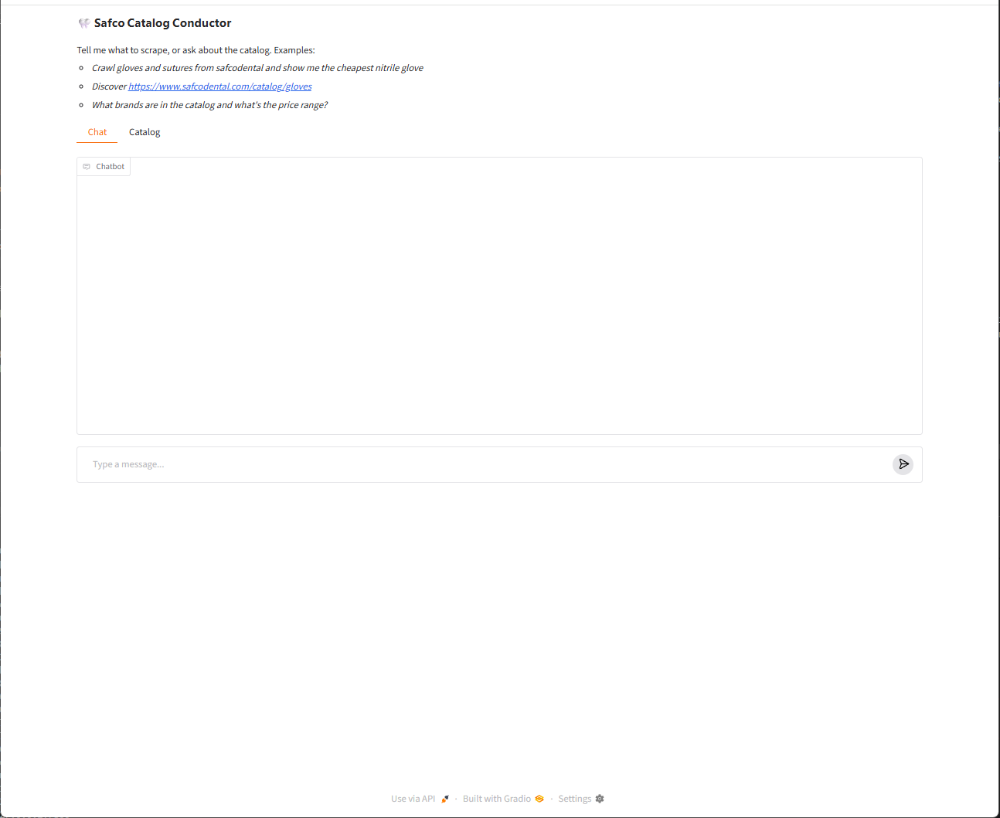

# Demo & Screenshots

Real, reproducible runs of the system. Transcripts below are actual output; the
screenshot slots are for you to fill once you run the UI locally (see the capture
guide at the bottom).

## 1. Default crawl (no key) — Safco, complete catalog via remembered recipe

`safco crawl` returns the **complete** catalog out of the box: the system has *learned* that
Safco's full data lives behind Algolia and cached that per-domain source recipe
(`profiles/safcodental.com/_source.json`), so it uses it automatically — no key, no config edit.

```text
$ safco crawl --fresh
... source.recipe_applied (safcodental.com -> algolia)
stored: 156 | by category: {Dental Exam Gloves: 100, Sutures & surgical products: 56}
coverage: name 100% sku 100% brand 99% price 100% description 100% variants 100%
-> data/ (json/csv/xlsx) + data/runtime/safco.db   # complete set also in data/safco_full/

$ safco crawl --fresh --source html        # explicit static-only sample (no API)
Stored 30 products -> data/ ...             # the 15-item curated set per category (committed at data/products.*)
```

## 2. How it knew — the completeness-critic

The recipe wasn't hardcoded; the **completeness-critic** earns it by noticing a static crawl is
short — reading the page's own true total via the browser tier, no hardcoded knowledge:

```text
$ safco check-completeness https://www.safcodental.com/catalog/gloves
{ "extracted": 15, "expected": 100, "complete": false,
  "method": "data-api:.../indexes/*/queries",
  "recommended_action": "Incomplete: captured 15 of 100. Escalate — replay the discovered API ..." }
```

That "15 of 100" verdict is exactly what justifies the cached Algolia recipe (and, for a brand-new
site, drives the autonomous-discovery loop — ROADMAP Phase 1.5).

## 3. Any-site + pagination (live, ethical) — books.toscrape.com

A non-JSON-LD site, crawled with a CSS profile + pagination following. Proves the
generic extractor is genuinely site-agnostic. Sample output: [../data/books_demo/](../data/books_demo/).

```text
$ safco crawl   # seeds = books.toscrape catalogue, max_pages: 3
pages_fetched: 3 | products_stored: 60 | dead_letters: 0 | blocked: 0
field_coverage: name 100%, price 100%, availability 100%, image_urls 100%
  - A Light in the Attic              | £51.77 | in_stock
  - Aladdin and His Wonderful Lamp    | £53.13 | in_stock
  ... (60 books across pages 1→2→3)
```

## 4. Compliance — anti-bot site is detected, not evaded (frontierdental.com)

Pointed at a Cloudflare-protected, AI-restricted site. The tool detects the block and
**hands off to a human instead of evading** — the production-minded behaviour.

```text
$ safco chat "crawl https://www.frontierdental.com/ca/en/home"
  🔧 crawl({"seed_urls": ["https://www.frontierdental.com/ca/en/home"]})
The site is protected by anti-bot measures (HTTP 403) and its robots policy disallows
AI crawlers. I did not attempt to bypass it. To proceed, a human would need to confirm
scraping is permitted and supply the page via an authorized browser.

$ safco stats
🙋 Human-help requests (1):
  - https://www.frontierdental.com/ca/en/home
      blocked: HTTP 403 (anti-bot / access denied)
      → Site is bot-protected. A human should confirm scraping is permitted (robots/ToS),
        then supply the page HTML from an authorized browser. Do NOT bypass the protection.
```

## 5. Grounded Q&A — conductor / reporter

Grounded over whatever is in the DB (here the `--source html` static sample; the default 156
catalog answers the same way over more rows):

```text
$ safco report "which nitrile gloves are under $10? name, sku, price"
1. Halyard Black Nitrile — DRCDL — $8.29
2. Compac Nitrile — DRCDM — $8.49

$ safco chat "summarize the catalog by brand"
  🔧 query_catalog({...})
Catalog by brand: Cranberry 4, Dash 3, Ansell 3, ...  (grounded in the stored rows)
```

## 6. Web UI (Gradio)

`safco ui` → http://127.0.0.1:7860. Two tabs:
- **Chat** — the conductor; ask about the catalog (*"which nitrile gloves are under $10?"*,
  *"summarize the catalog by brand"*) or tell it to crawl a site. Every answer is grounded in
  the database — it calls a tool and reports only what the rows say.
- **Catalog** — the live product table + summary; click **Refresh** to load the current DB.



> **These screenshots show the 30-product `--source html` static sample; the DB is not capped.**
> The default `safco crawl` loads the complete **156** (the system remembers Safco → Algolia), and
> the same chat answers over whatever is loaded — in production it scales to the entire site. Same
> chat, same tools, however many products are loaded.


*"Which nitrile gloves are under $10?" → the conductor calls `query_catalog` and lists only
the two matching rows (Halyard Black Nitrile $8.29, Compac Nitrile $8.49) — grounded, no guessing.*


*The Catalog tab renders the current DB with a deterministic summary (counts, price range, brands).*

---

## How to capture the UI screenshots / a GIF

1. Enable a backend in `config.yaml` (`llm.backend: claude_cli` or `anthropic`).
2. In a **normal terminal** (not inside Claude Code), run:
   ```bash
   pip install -e ".[ui]"
   safco ui
   ```
3. The browser opens at http://127.0.0.1:7860.
   - **Chat tab**: ask a single-step catalog question (fast + reliable) — e.g.
     *"which nitrile gloves are under $10?"* or *"summarize the catalog by brand"* — and
     screenshot the grounded answer. (Avoid the slow crawl-in-chat on the `claude_cli` backend.)
   - **Catalog tab**: click **Refresh**, screenshot the product table + summary.
4. Save the images as `docs/images/ui-chat.png` and `docs/images/ui-catalog.png`.
   They'll render in the embeds above.
5. For a short GIF, use [ScreenToGif](https://www.screentogif.com/) (Windows) or
   `Win+G` Game Bar to record a 10–15s clip of one chat → result, and save as
   `docs/images/demo.gif`.
